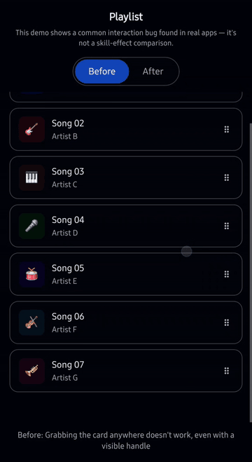

# interaction-doctor

**Other skills help agents *build* UI. This one helps them *fix* interactions that broke.**


<!-- TODO before launch: record a 6–8s screen capture — drag a card in a
     scrolling list, show it scrolling the page instead of moving the card,
     then apply touch-action: pan-y and show it working. Kap on macOS. -->

---

## Sound familiar?

- Dragging a card in a scrolling list scrolls the page instead of moving the card.
- The same drag code works on your iPhone and does something completely different
  on Android — or the reverse.
- A swipe-to-delete row sometimes scrolls, sometimes deletes, and you can't tell why.
- Pinch-to-zoom works in your dev build and then zooms the whole page in production —
  on one platform only.
- The AI agent building your UI fixes drag, breaks scroll. Fixes scroll, breaks tap.
  Fixes tap, breaks long-press. You're playing whack-a-mole with pointer events.

None of this is a bug in your code. It's five platforms disagreeing about what a
touch means, and nobody told your coding agent.

---

## Install

**Claude Code (plugin)**
```
/plugin marketplace add interaction-doctor/interaction-doctor
/plugin install interaction-doctor@interaction-doctor
```

**Any agent (skills.sh)**
```
npx skills add interaction-doctor/interaction-doctor
```

**Manual**
```
git clone https://github.com/interaction-doctor/interaction-doctor
cp -r interaction-doctor/skills/interaction-doctor ~/.claude/skills/
```

---

## Before / After

**Before** — prompt only:

```
> My drag handler works on desktop but on mobile the page scrolls
  while I'm trying to drag the card.

< I'll add preventDefault() to stop the scroll...
> Now the whole page won't scroll at all, even outside the card.
< Let me make it conditional on the drag state...
> Now dragging feels laggy and sometimes doesn't start.
< I'll add a delay before activating the drag...
> Now long-pressing opens the browser context menu instead.
  (5 turns, still broken)
```

**After** — same prompt, skill installed:

```
> My drag handler works on desktop but on mobile the page scrolls
  while I'm trying to drag the card.

< This is C10 in the conflict matrix — the browser owns touch
  scrolling by default. Set touch-action: pan-y on the draggable
  element: vertical scroll stays with the browser, your handler
  gets the horizontal axis. Also add a pointercancel listener —
  the browser can reclaim the pointer mid-drag on iOS specifically,
  and without it the element gets stuck mid-transform.
  (1 turn, matches the measured behavior on iOS/Android/desktop)
```

*(Illustrative — see [Numbers](#numbers) for the measured version of this comparison.)*

---

## Numbers

🚧 Not yet measured. The next step for this project is running the eval
harness (`evals/`) across a broken-component test set with and without the
skill installed, using Claude Code's `--output-format json` to get exact
turn counts and cost per session — see the roadmap below. This section will
report real numbers, not estimates, once that run is complete.

---

## The conflict matrix

Ten of the twenty-one possible gesture-pair conflicts are documented below,
each verified on real hardware — desktop Chrome, iOS Safari, Android Chrome,
and iPadOS Safari — not simulators. Every cell links to symptom, cause,
platform-by-platform measured behavior, a working fix, and how to verify it
yourself. The three still marked `🚧` are open — see
[Contributing](#contributing).

| | Tap | DoubleTap | LongPress | Drag | Swipe | Scroll | Pinch |
|---|---|---|---|---|---|---|---|
| **Tap** | — | [C1](CONFLICTS.md#c1--tap--doubletap) | [C2](CONFLICTS.md#c2--tap--longpress) | [C3](CONFLICTS.md#c3--tap--drag) | 🚧 | 🚧 | 🚧 |
| **DoubleTap** | C1 | — | 🚧 | 🚧 | 🚧 | 🚧 | 🚧 |
| **LongPress** | C2 | 🚧 | — | [C6](CONFLICTS.md#c6--longpress--drag) | 🚧 | [C8](CONFLICTS.md#c8--longpress--scroll) | 🚧 |
| **Drag** | C3 | 🚧 | C6 | — | [C9](CONFLICTS.md#c9--drag--swipe) | [C10](CONFLICTS.md#c10--drag--scroll) | [C11](CONFLICTS.md#c11--drag--pinch) |
| **Swipe** | 🚧 | 🚧 | 🚧 | C9 | — | [C12](CONFLICTS.md#c12--swipe--scroll) | 🚧 |
| **Scroll** | 🚧 | 🚧 | C8 | C10 | C12 | — | [C13](CONFLICTS.md#c13--scroll--pinch) |
| **Pinch** | 🚧 | 🚧 | 🚧 | C11 | 🚧 | C13 | — |

Full detail, with per-platform trial counts and raw measurement logs, is in
[`CONFLICTS.md`](CONFLICTS.md).

**The finding worth reading first**: [C13](CONFLICTS.md#c13--scroll--pinch).
`touch-action: pan-y` — the standard fix for drag-vs-scroll — has the
*opposite* effect on pinch-zoom depending on platform. On Android it zooms
just like `touch-action: auto` would (6 of 6 measured trials). On iOS and
iPadOS it blocks zoom completely, identically to `touch-action: none` (0 of
13 combined trials). A developer who tests only on iPhone will ship code that
zooms uncontrollably on every Android device that runs it.

---

## Try it live

**[Interaction Inspector →](https://interaction-doctor.dev)**
<!-- TODO before launch: point this at the deployed apps/inspector build -->

Drag, tap, and pinch against real pointer events in your own browser. Toggle
`touch-action` live and watch the verdict change in front of you — this is
the same tool used to produce every number in the matrix.

---

## Why this exists

Four mature, actively maintained gesture libraries — dnd-kit, Framer Motion,
embla-carousel, and vaul — have collectively closed roughly **168 GitHub
issues** touching `touch-action`, drag-vs-scroll conflicts, and mobile drag
failures. Teams with funding, maintainers, and years of production traffic
needed that many issues to get pointer-event handling right.

A coding agent asked to "make this card draggable" writes that logic from
scratch, in one shot, with none of that history. The quotes below are from
real issues in those libraries — the exact failure modes this project's
matrix documents, reported by real users of production software:

> *"when I touch and hold a draggable, it gets 'stuck' and cannot move
> anymore... If I have touch action set to none, then I am able to drag the
> draggable around, but the list doesn't scroll normally anymore"*
> — [dnd-kit #453](https://github.com/clauderic/dnd-kit/issues/453) (see [C10](CONFLICTS.md#c10--drag--scroll))

> *"it interprets my finger's scroll input with a drag input... it would be
> great if the interface understood the natural difference between a drag
> and a scroll"*
> — [motion #1506](https://github.com/motiondivision/motion/issues/1506) (see [C10](CONFLICTS.md#c10--drag--scroll))

> *"it will begin dragging, but suddenly stop when the dock opens and the
> pointercancel event is called, at which point the drawer remains 'stuck'"*
> — [vaul #555](https://github.com/emilkowalski/vaul/issues/555)

This isn't a criticism of those projects — quite the opposite. It's evidence
of how much platform-specific knowledge production-grade touch handling
actually requires, and how little of it is written down in one place, in a
form an AI agent can act on before the code ships.

Full methodology and limitations: [`research/demand.md`](research/demand.md).

---

## Prior art — what this doesn't replace

This project enforces existing standards; it doesn't invent new ones.

- **[W3C Pointer Events](https://www.w3.org/TR/pointerevents3/)** — the
  `touch-action` property and pointer-capture semantics this whole matrix is
  built on.
- **[MDN `touch-action`](https://developer.mozilla.org/en-US/docs/Web/CSS/touch-action)**
  — the authoritative reference for the property itself.
- **[WCAG 2.5.1 / 2.5.2 / 2.5.7](https://www.w3.org/WAI/WCAG22/quickref/)**
  — pointer-gesture and dragging-movement accessibility requirements this
  project treats as non-negotiable, not optional.
- **[dnd-kit](https://dndkit.com/)** — the reference implementation for
  accessible, cross-platform drag-and-drop reordering. If your use case is
  reordering a list, use it; don't hand-roll C10's fix yourself.
- **[React Native Gesture Handler](https://docs.swmansion.com/react-native-gesture-handler/)**
  and **[Flutter's Gesture Arena](https://docs.flutter.dev/ui/interactivity/gestures)**
  — the native-mobile equivalents of the conflict-resolution problem this
  project documents for the web.

If a library already solves your specific problem well, the skill points you
to it instead of asking you to reinvent it.

---

## Contributing

Three matrix cells are undocumented — Tap↔Swipe, DoubleTap↔Pinch, and
LongPress↔Swipe. Filling one in means measuring it on real hardware
(desktop, iOS, Android at minimum) using the harnesses in `tools/`, following
the format of any completed section in `CONFLICTS.md`, and submitting the raw
logs alongside the write-up — see
[`research/measurements/README.md`](research/measurements/README.md) for the
provenance conventions this project holds every figure to.

Corrections to a completed cell are just as welcome. Every number in
`CONFLICTS.md` traces to a raw log in `research/measurements/`; if you can't
find the source for a claim, that's a bug — open an issue.

---

## License

MIT
