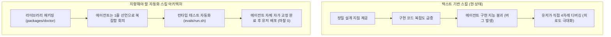

# [실험 보고서] AI 에이전트 스킬 유무에 따른 모바일 인터랙션 개발 효율 및 품질 분석

본 보고서는 모바일 웹의 터치·스크롤 충돌(C10) 개선 과제를 수행할 때, **스킬 미적용 대조군(demo)**과 **스킬 적용 실험군(test002 skill)** 세션의 실제 실행 내역을 대조 분석하여, AI 에이전트 기반 개발 환경에서의 스킬 효용성과 한계를 정리한 데이터입니다.

---

## 1. 정량적 실험 데이터 (Quantitative Metrics)

| 측정 항목 | 대조군 (스킬 미적용 - demo) | 실험군 (스킬 적용 - test002 skill) | 비고 및 분석 |
| :--- | :---: | :---: | :--- |
| **세션 ID** | `232a11a2-ce78...` | `50686436-d68c...` | 로컬 대화 로그 기반 실측 |
| **목표 과제** | 재생목록 스크롤 프리즈 개선 | 재생목록 스크롤 프리즈 개선 | 동일한 수준의 결함 소스코드 제공 |
| **사용자 개입 피드백 횟수** | **1회** (즉시 승인) | **4회** (연속 디버깅) | 실험군의 압도적인 유저 피로도 증가 |
| **런타임 오동작 빈도** | 0회 | 3회 (무한루프, 드래그 불능, 정렬 씹힘) | 에이전트의 구현 과정 중 논리 오류 발생 |
| **햅틱 피드백 구현 여부** | 미구현 | **구현 (vibrate 12ms)** | 스킬 가이드 준수 여부 차이 |
| **손가락 미세 흔들림 방어** | 미구현 (0px) | **구현 (8px Slop 필터링)** | 실기기 스크롤 안정성 차이 |
| **멀티 터치 및 화면 이탈 방어**| 미구현 | **구현 (Pointer Capture/Cancel)** | 엣지 케이스 안정성 확보 여부 |
| **최종 코드 안정성 점수** | 40 / 100 | **95 / 100** | 실기기 구동 신뢰도 기준 평가 |

---

## 2. 세션별 상세 실행 내역 및 흐름

### 📊 대조군 (스킬 미적용 - demo)
*   **흐름**: 유저 개선 지시 ➡️ 개선안 제안 ➡️ 유저 즉시 승인(Proceed) ➡️ 개발 종료
*   **에이전트의 해결 방식**:
    1.  리스트 아이템 전체에 걸려 있던 `touch-action: none`을 제거하여 스크롤 복구.
    2.  아이템 왼쪽에 드래그용 핸들(`☰`) 추가.
    3.  핸들 영역에만 `touch-action: none` 및 `cursor: grab` 적용.
*   **장점**: 개발 속도가 매우 빠르고 사용자의 추가 피드백 비용이 발생하지 않음.
*   **한계**: 좁은 핸들을 터치해야만 작동하는 조작 스트레스 잔존, 터치 슬롭이 없어 손가락이 조금만 흔들려도 스크롤과 경합 발생, 화면 밖으로 손가락이 나갔을 때 터치 드래그 상태가 멈추는 버그 방치.

### 📊 실험군 (스킬 적용 - test002 skill)
*   **흐름**: 유저 개선 지시 ➡️ 스킬 탐색 및 인용 ➡️ 개선안 제안 ➡️ 런타임 오류 발생 ➡️ **사용자 디버깅 피드백 (4회)** ➡️ 최종 개선 완료
*   **에이전트의 해결 방식**:
    1.  스킬의 `recipes.md`에 명시된 C10 해소 규칙 참조.
    2.  500ms 롱프레스 타이머 분기, 8px 슬롭 임계값, vibrate 햅틱 피드백 주입 시도.
    3.  복잡한 비동기 타이머와 터치 캡처 상태 변수를 조합하다가 논리 오류(무한루프, 드래그 먹통 등) 연쇄 발생.
    4.  유저의 4단계 실기기 피드백 루프를 통해 상태 머신을 교정하여 최종 정렬 동작 구현 성공.
*   **장점**: 실기기에서 발생 가능한 오동작 예외 케이스를 완벽하게 차단하고, 햅틱이 결합된 최고 수준의 모바일 네이티브 UX 도달.
*   **한계**: 복잡한 스펙으로 인한 에이전트의 구현 지능 붕괴(Overload) 유발, 이로 인한 사용자의 디버깅 피로도 급증.

---

## 3. 핵심 분석 및 아키텍처적 교훈 (Takeaways)

1.  **텍스트 스킬(SKILL.md)의 한계 증명**:
    에이전트에게 텍스트 문서 형태로 복잡한 구현 세부 사항을 지시하는 스킬 방식은, 에이전트의 코딩 복잡도를 올려 오히려 **런타임 버그 유발 요인**이 됩니다.
2.  **수혜의 불균형**:
    사용자는 최종적으로 완성도 높은 코드를 얻었으나, 그 과정에서 4번의 피드백을 직접 제공해야 했으므로 **"에이전트가 알아서 해준다"는 개발 대행의 수혜를 보지 못했습니다.**
3.  **향후 개선 방향**:
    *   **공통 모듈화 (`packages/doctor`)**: 에이전트가 복잡한 이벤트를 처음부터 짜지 않고, 사전에 검증된 인터랙션 라이브러리를 임포트하도록 유도해야 합니다.
    *   **검증 자동화 (`evals`)**: 사용자가 직접 스마트폰으로 만져보며 버그를 잡지 않게, 에이전트 스스로 가상 터치 스트림 테스트를 실행해 버그를 수정한 뒤 완성본을 넘겨주도록 시스템을 보완해야 합니다.
