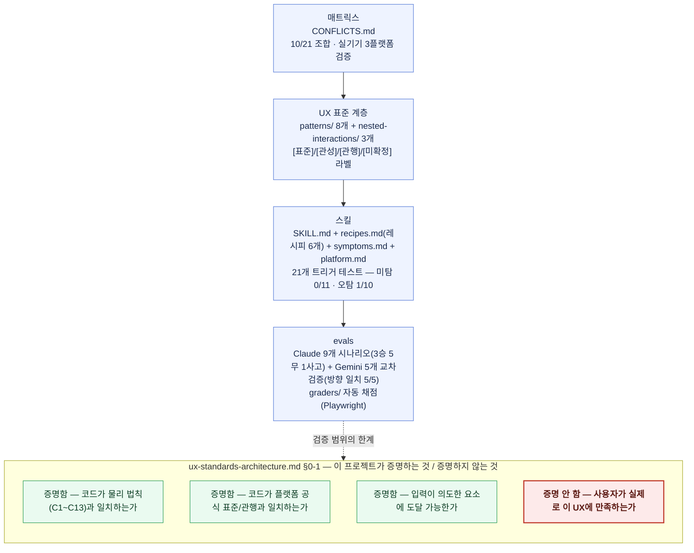

# interaction-doctor — 체계 다이어그램

이 문서는 `README.md`에 넣을 전체 구조 다이어그램이다. 추상적 설명이
아니라 오늘 실제로 완성된 산출물의 개수·검증 방식을 라벨로 붙였다.
숫자는 아래 "라벨 근거" 절에서 각각 출처 문서를 밝힌다.

## 다이어그램 (Mermaid — GitHub에서 그대로 렌더링됨)

GitHub의 Mermaid 지원 범위를 먼저 확인했다 — 기본 flowchart
문법(노드 도형, 화살표, `subgraph`, `style`/`classDef`)은 지원되지만
FontAwesome 아이콘 라벨, 라벨 내부 하이퍼링크/툴팁, ELK 레이아웃
엔진은 지원되지 않는다. 아래 다이어그램은 이 범위 안에서만
작성했다(그 셋 다 안 씀).



---

## 텍스트 대체본 (렌더링 안 될 때용)

```
[매트릭스]
  CONFLICTS.md — 10/21 조합, 실기기 3플랫폼(Android/iPadOS/iOS) 검증
        │
        ▼
[UX 표준 계층]
  patterns/ 8개 + nested-interactions/ 3개
  라벨: [표준] / [관성] / [관행] / [미확정]
        │
        ▼
[스킬]
  SKILL.md + recipes.md(레시피 6개) + symptoms.md + platform.md
  21개 트리거 테스트 — 미탐 0/11, 오탐 1/10(N9, 미해소)
        │
        ▼
[evals]
  Claude 9개 시나리오 — 3승 5무 1사고
  Gemini 5개 교차검증 — Claude와 방향 일치 5/5(독립 표본, 합산 안 함)
  graders/ 로 Playwright 자동 채점
        │
        ┊ (검증 범위의 한계)
        ▼
[ux-standards-architecture.md §0-1 — 증명함 / 증명 안 함]
  증명함     코드가 물리 법칙(C1~C13)과 일치하는가
  증명함     코드가 플랫폼 공식 표준/관행과 일치하는가
  증명함     입력이 의도한 요소에 도달 가능한가
  증명 안 함  사용자가 실제로 이 UX에 만족하는가   ← 이 프로젝트가
                                                     한 번도 증명한 적 없음
```

---

## 라벨 근거 (각 숫자의 출처)

| 라벨 | 근거 문서 |
|---|---|
| "10/21 조합, 실기기 3플랫폼 검증" | `CONFLICTS.md` — Matrix 7×7(대각선 제외 21개 조합) 중 C1,C2,C3,C6,C8,C9,C10,C11,C12,C13 10개 문서화(C4/C5/C7은 "🚧 not yet documented"). "Verified on: Android 10/Chrome, iPadOS 26.6/Safari, iOS 18.7/Safari" 매 절마다 명시 |
| "8개 + 3개, 라벨 4종" | `research/ux-standards/patterns/` 8개 파일, `nested-interactions/` 3개 파일. 라벨 정의는 `ux-standards-architecture.md` §4 |
| "레시피 6개" | `recipes.md` — 레시피 1(롱프레스 3중충돌), 2(바텀시트), 3(사이드드로어), 4(재정렬-핸들없음), 5(스와이프 삭제, 플랫폼 분기), 6(재정렬-핸들있음) |
| "미탐 0/11, 오탐 1/10" | `docs/stats.md` §3, `evals/trigger-tests/cases.md` — N9(독립 핀치줌)만 미해소, N6은 SKILL.md description 수정으로 해소됨 |
| "Claude 9개(3승 5무 1사고)" | `evals/RESULTS.md` "전체 요약" — treatment 우위 3건(01,08,09) · 동률 5건(02,04,05,06,07) · 실행 사고 1건(03). treatment-v3(레시피5 적용) 이후에도 이 마스터 집계는 의도적으로 유지 — v3는 각주(†)로 별도 재검증 층임을 명시해 둠, 합산하지 않음 |
| "Gemini 5개, 방향 일치 5/5" | `evals/RESULTS.md` "Gemini 교차검증" — 01,02,04,05,09 확보, 전부 Claude와 결론 방향 일치. 03/06/07/08은 미확보. Claude 9개·Gemini 5개는 독립 표본, 합산 안 함 |
| §0-1 4줄 | `ux-standards-architecture.md` §0-1 "이 프로젝트가 증명하는 것과 증명하지 않는 것" 원문 그대로 |

**지시받은 라벨과 다르게 처리한 것 2곳** (사용자 확인 후 실제 기록대로
수정):
- 스킬 단계: "오탐 0/10" → **"오탐 1/10"**(N9 여전히 미해소).
- evals 단계: "4승 5무 1사고" → **"3승 5무 1사고"**(RESULTS.md 마스터
  집계 원문 그대로, treatment-v3 이후에도 안 바뀜).
- "8/33 컴포넌트"의 "33"은 이 저장소 어디에도 근거가 없어(§6 "30~50개
  규모로 수렴한다고 보되"라는 추정치뿐, "33"이라는 특정 숫자는 없음)
  빼고 "8개 + nested-interactions 3개"로 정확하게 남겼다.
